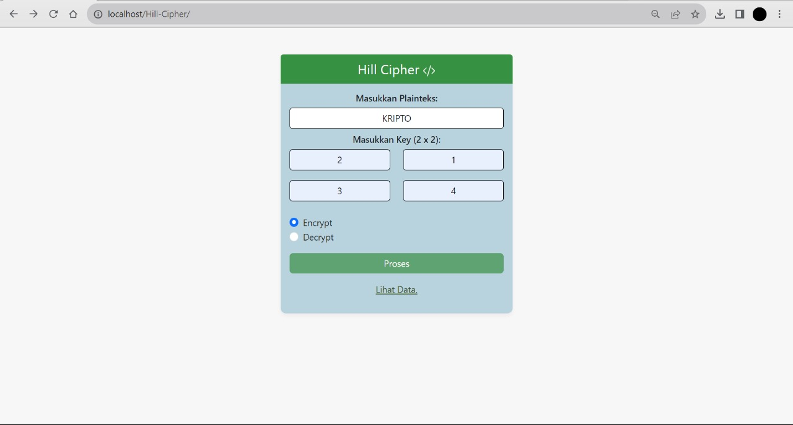
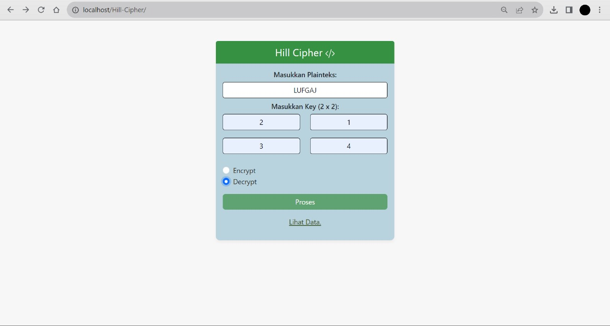
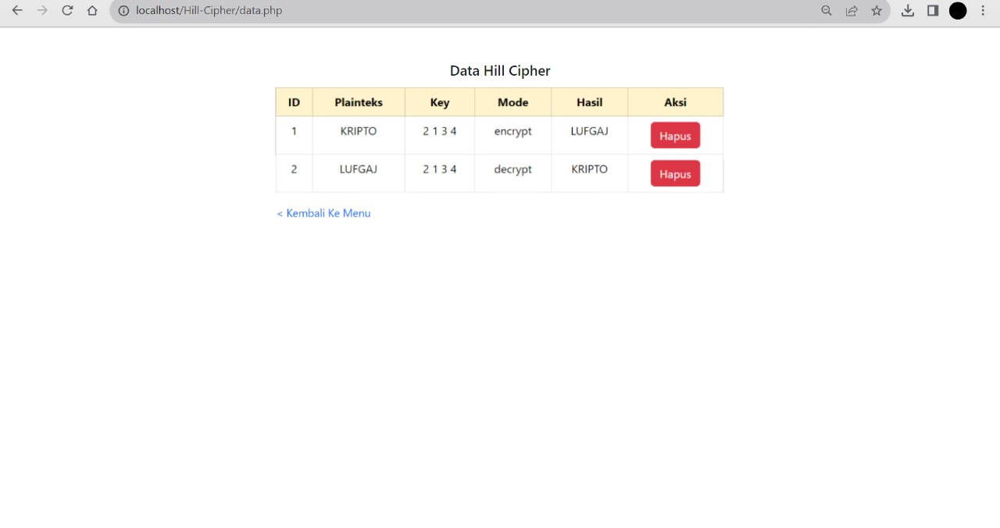

# Hill_Cipher

## Profil
**_
Nama: Ilham Ramadhan
_**
**_
Kelas: TI.21.A.1
_**
**_
Nim: 312110609
_**

## Penjelasan

## Encryption Hill Cipher

Hill Cipher adalah suatu algoritma enkripsi yang termasuk dalam kategori cipher substitusi linier. Metode ini mengoperasikan pada blok-blok teks tergantung pada panjang kunci enkripsi. Hill Cipher memanipulasi teks terbuka dengan mengalikan matriks kunci (matriks enkripsi) dengan matriks dari blok teks terbuka. Hasil perkalian matriks tersebut kemudian diubah kembali menjadi teks terenkripsi.

## Hasil
- **Encrypt**
>

- **Decrypt**

- **Data**

